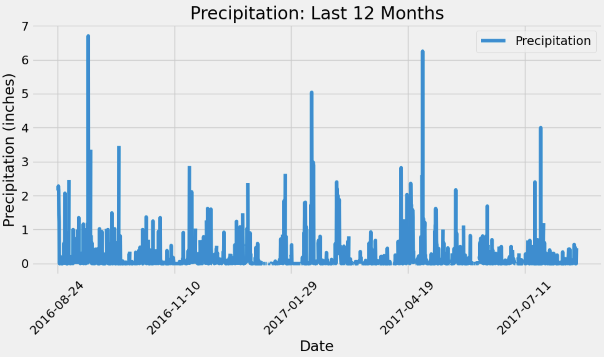

# sqlalchemy-challenge

# Project Goal
This project will aim to conduct a climate analysis of Honolulu, Hawaii as it will be a vactation destination.  
The analysis will be separated by two parts, the Climate Data Analysis and the Climate App Design. Within the subdirectory: "Surfs Up", you will find the Climate Analysis on the climate_starter.ipynb file, and the App Design on the app.py file. 

# Breakdown
Precipitation Analysis
- Data for 12 months is analyzed to result in a visual that displays the amount of precipitation (in inchnes) over time.

Station Analysis
- Queries were used to find the total number of stations, the most active ones, and then a more in depth analysis of the most active to find the lowest, highest and average temperature. 
- The resulting visual displayes 12 months of the temperature observation data for the most active station

Climate App Design
- Flask will be used to create an application based on the above queries. The result indicates a home page with different routes. The static routes: precipitation, stations, and tobs. Along with dynamic routes: start route and start/end route. 

# Tools
Python, SQLAlchemy, Pandas, Matplotlib, Numpy, Datetime
Flask, JSON

# References
Stack Overflow and ChatGPT were referenced to review any code errors.